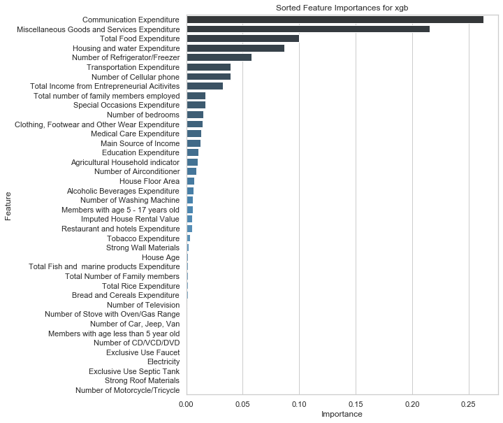
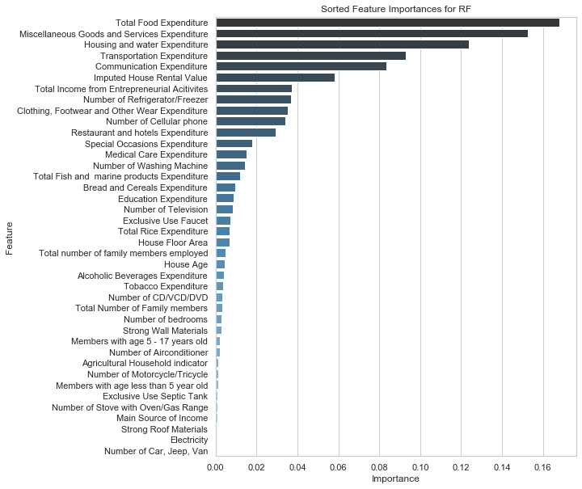
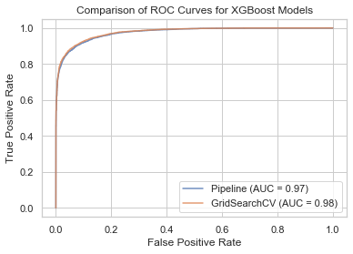

# Introduction - Classifying Household Income in the Philippines

For the Module 3 Project, I performed a supervised binary classification exercise on a dataset to predict whether a household earns below or above the median household income in the Philippines. 

My aim as a Data Science student with this exercise is to identify the features of a household that are the strongest indicators of whether a family is earning above the median through several different modeling techniques. There is a high potential for maintaining this project by comparing these results to the survey results everty three years.

## Libraries
* For data cleaning/exploration: pandas, NumPy
* For plotting: Matplotlib, seaborn, Scikit-plot, pydotplus, IPython
* For modeling: scikit-learn, XGBoost

# The Dataset 
The Family Income and Expenditure Survey (FIES) from 2015 is available [here on Kaggle](https://www.kaggle.com/grosvenpaul/family-income-and-expenditure) consists of over 40K rows and 60 columns and is collected by the Philippine Statistics Authority every three years. 

## Target
**Total Household Income** consists of continuous data which I initially converted into two classes (0/1), with 1 indicating that a makes above the median income. 

## Features
The 59 features are all descriptive of households through spend, household structure, possessions, and living conditions, as I categorize them below. 

* **Expenditures**: Total Food Expenditure, Bread and Cereals Expenditure, Total Rice Expenditure, Meat Expenditure, Total Fish and  marine products Expenditure, Fruit Expenditure,Vegetables Expenditure, Restaurant and hotels Expenditure, Alcoholic Beverages Expenditure, Tobacco Expenditure, Clothing, Footwear and Other Wear Expenditure, Housing and water Expenditure, Transportation Expenditure, Communication Expenditure, Education Expenditure, Miscellaneous Goods and Services Expenditure, Special Occasions Expenditure, Medical Care Expenditure, Crop Farming and Gardening expenses
* **Household Descriptions**: Region, Main Source of Income, Agricultural Household indicator, Imputed House Rental Value, Total Income from Entrepreneurial Acitivites, Household Head Sex, Household Head Age, Household Head Marital Status, Household Head Highest Grade Completed, Household Head Job or Business Indicator, Household Head Occupation, Household Head Class of Worker, Type of Household,Total Number of Family members, Members with age less than 5 year old, Members with age 5 - 17 years old, Total number of family members employed
* **Possessions**: Number of Television, Number of CD/VCD/DVD, Number of Component/Stereo set, Number of Refrigerator/Freezer, Number of Washing Machine,Number of Airconditioner, Number of Car, Jeep, Van, Number of Landline/wireless telephones, Number of Cellular phone, Number of Personal Computer, Number of Stove with Oven/Gas Range, Number of Motorized Banca, Number of Motorcycle/Tricycle
* **Living Conditions**:Type of Building/House, Type of Roof,Type of Walls, House Floor Area, House Age,Number of bedrooms, Tenure Status, Toilet Facilities, Electricity,Main Source of Water Supply,

# EDA

My primary goal was to reduce/condence the number of features in my dataset, optimally to 30-40, and not to add additional dummy variable columns. I eliminated 10 columns during EDA in three phases. 
1) Object columns with missing values
2) Object columns with no clear correlation with Household Income based on a countplot
3) Continuous columns with very few non-zero values

I also converted several columns from object values to one-hot encoded variables where there was a visible correlation between a variable and income.

# Modeling 

I used scikit-learn's train-test split (70/30) to enable model validation for every estimator, and used Pipeline to condense normalization/estimation/grid searching for all models except for LogisticRegression. Below is a summary table of how each model performed. Please note that due to the result of my Recursive Feature Elimination resulting in 40 columns, from RFE downwards all models only use 40 features.

## XGBoost
My best model type is XGBoost, which is a weak learning model(here, a decision tree with a low max-depth) that calculates overall loss in order to iterate a new weak learner to minimize loss. 

I iterated on this model as well with a Grid Search, and passed in max-depth, minimum weight of a child(I chose both 1 and 5 to get a try a range of sensitivities) and the number of estimators (10, 30 and 100). The best-performing parameters measured by accuracy are learning_rate: 0.1, max_depth: 5, min_child_weight: 5, n_estimators: 100.

# XGBoost Evaluation

The highest performing model across all scores was the XGBoost. As this is a popular model of choice, enabling us to work within the best qualities of ensemble methods and decision trees, using weak learners (decision trees of a fixed size) to identify features of importance. 

Our model returned the following as our most important features:

Unsurprisingly, similar features had also been identified as most significant by our Random Forest model (Food, Communication, Housing/Water, Income From Entrepreneurial Activities, Transportation). 

We can also see based on an ROC Curve, showing the tradeoff between false positives and true positives, that these models are hugging the upper left corner. The AUC score for the XGBoost model is high at .98 (the optimal value being 1).

In my dataset, we can say with a high degree of confidence that we are able to identify the features that are most correlative to a household's total income. All of these modeling techniques highlighted an ability to accurately identify these above-the-median incomes with some skew towards recall or precision, but XGBoost was the most balanced in terms of performance.

#  Further Work
**Regional Comparison** | As there are seventeen regions with their own major industries/characteristics (tourism, agriculture, urbanization), it would be interesting to compare feature importances between regions, and to see whether models perform better at a regional level where the features are more specific to that area.

**Update Data** | This survey takes place every three years, so a comparison of how the spread of expenditures may have been redistributed would be useful to better understand the population spend and to understand how the makeup of the household and how they make/spend money is changing over time; for example, spend on communication was likely much different before smartphones and internet were as accessible and necessary.

**Feature Engineering** | Enhancements can be made to reduce the number of expenditures and possessions based on their nature (i.e., meat and fish together, alcohol and tobacco, and perhaps number of large electronics and a category compounding the living condition aspects that could result in a "grade" rather than descriptions of a roof or wall.